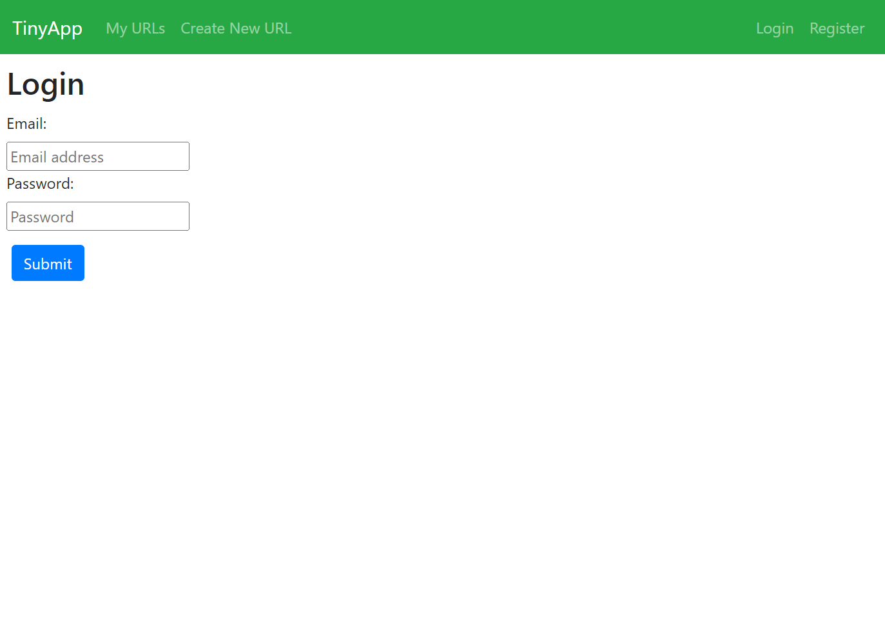
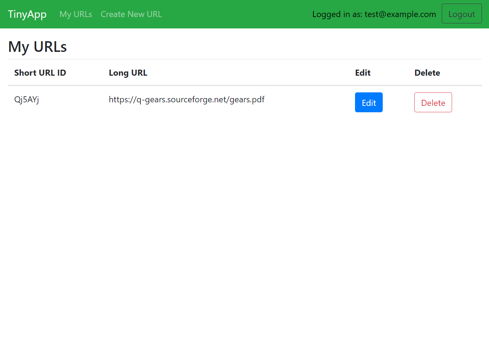
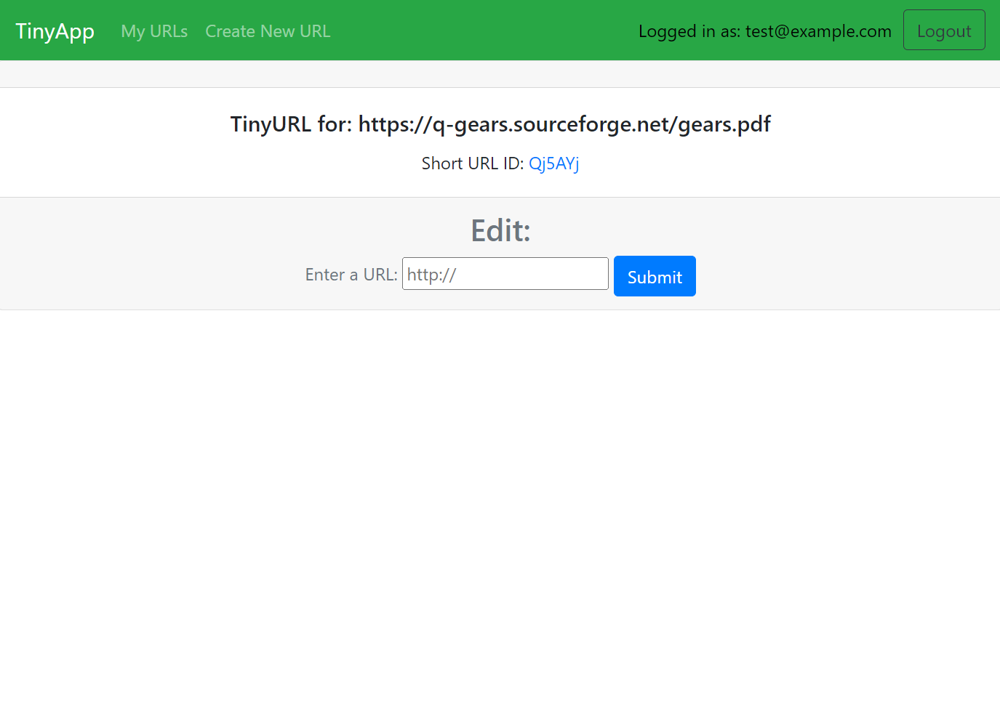

# TinyApp Project
⚠️ <b>Please note that this project was made during the Lighthouse Labs Web Development Bootcamp, and may not be up to par for real-world implementation in its current state!</b> ⚠️

TinyApp is a full stack web application built with Node and Express that allows users to shorten long URLs (à la bit.ly). URLs are separated by user, but the short URL links can be used by guests.

<b>Notice:</b> The databases are currently stored within the server file directly, therefore any accounts and links will be wiped upon server reset. Please don't store anything that you're not willing to lose!

## Final Product

## Dependencies

- Node.js
- Express
- EJS
- bcryptjs
- cookie-session

## Getting Started

- Clone the project or download the code directly from the repository.
- Install all dependencies using the `npm install` command from within the project's root folder.
- Run the development web server using the `node express_server.js` command.
- Go to `localhost:8080` in your browser to register and start adding your links!